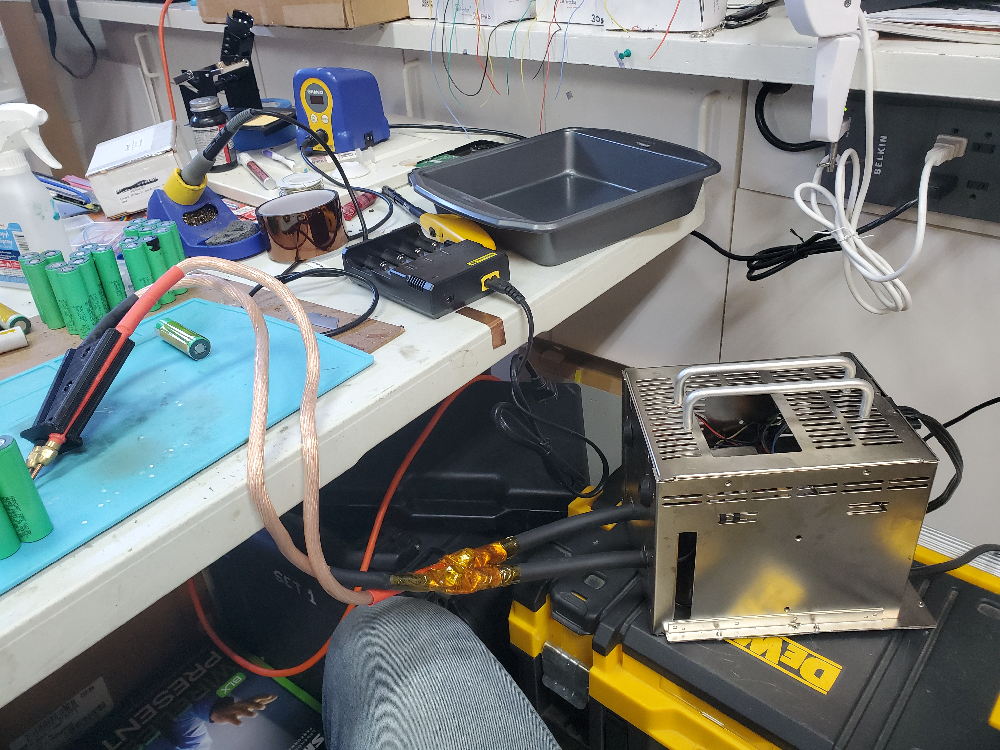
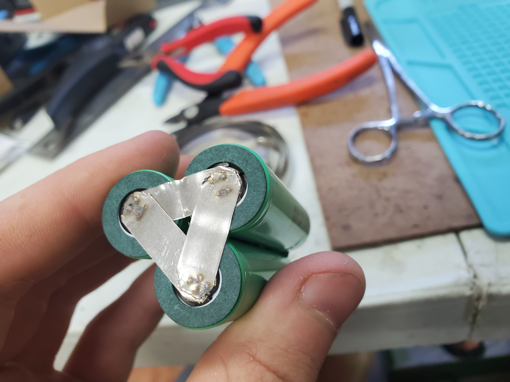
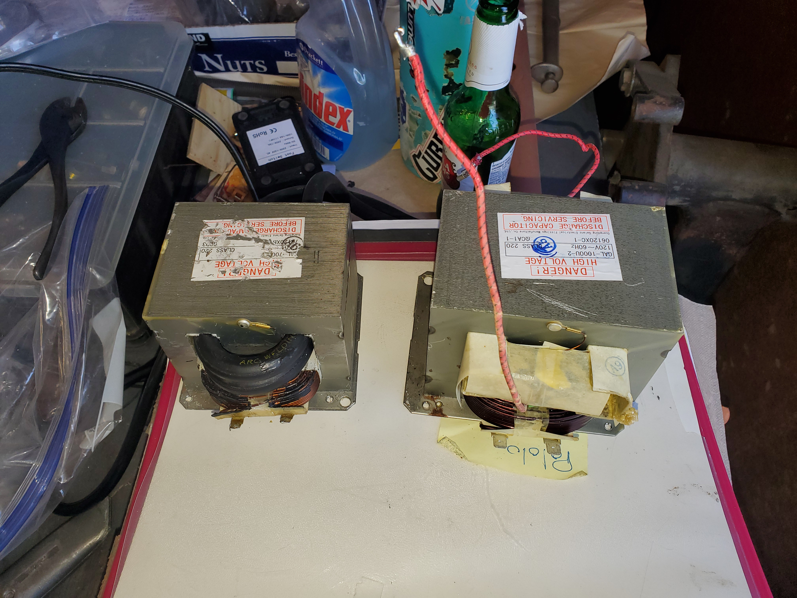
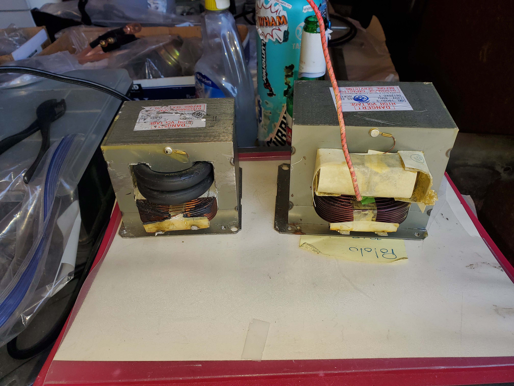
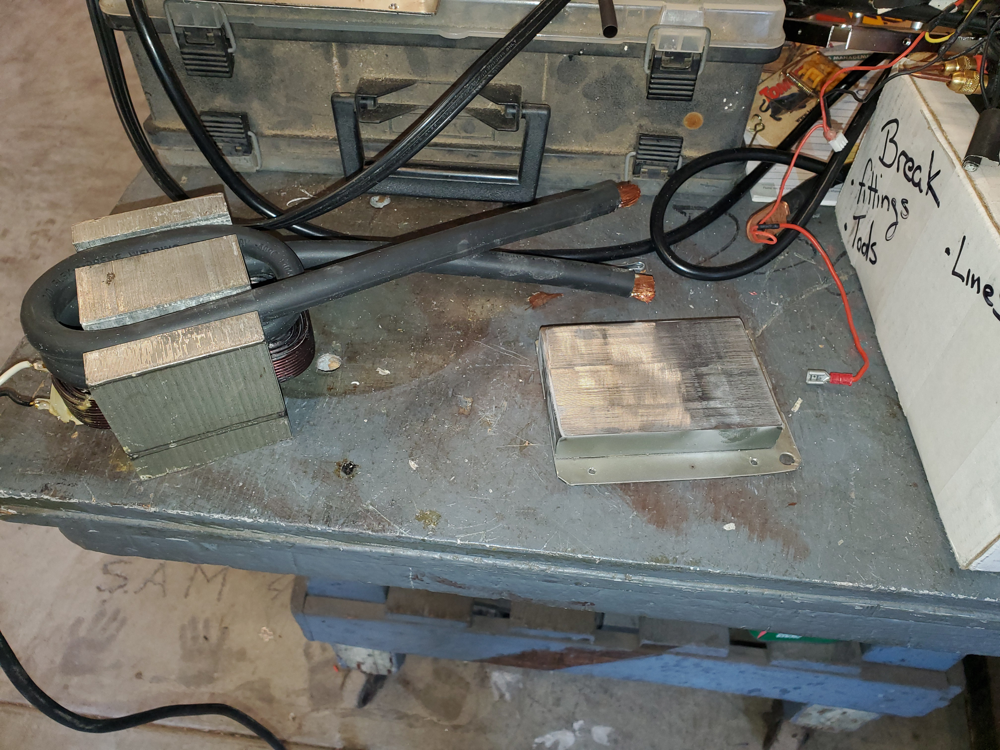
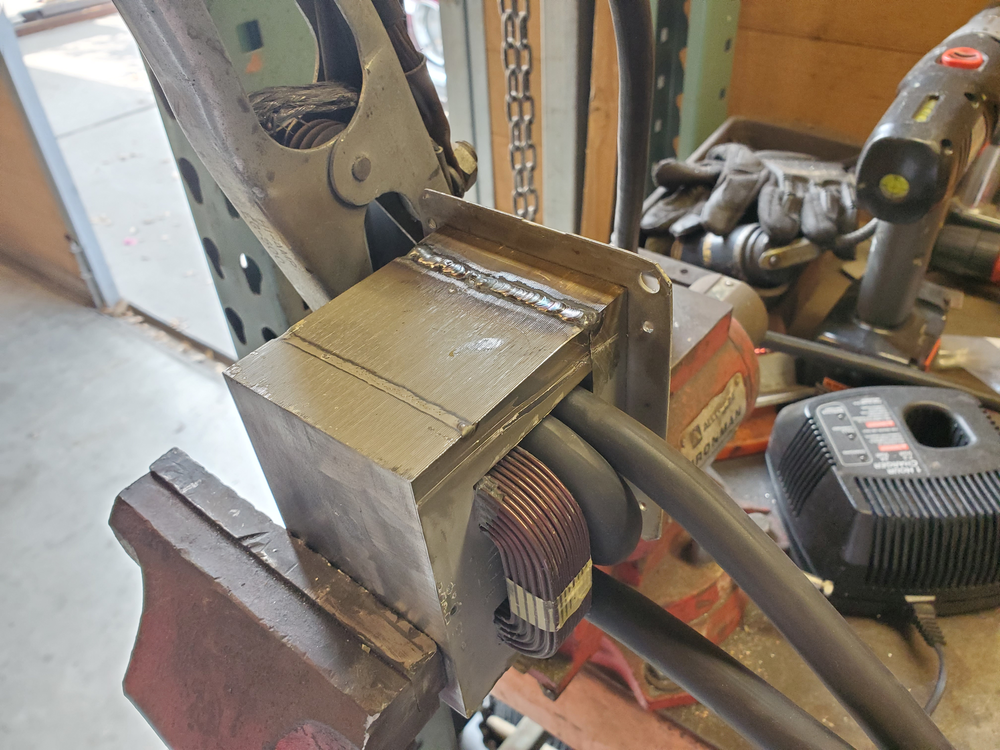
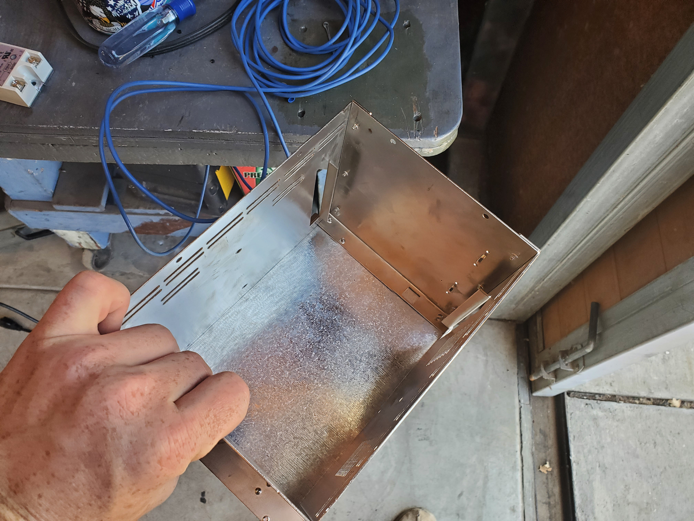

# DIY Spot Welder
DIY spot welder from old microwave for making Li-ion 18650 packs with nickel strips.
Uses bluetooth communication in custom Android app to adjust welding parameters.

Video of welder in use (plus how strong welds can be): https://www.youtube.com/watch?v=DYY4uMhj9es&ab_channel=whittyman  
Photos of build progression (Google photos): https://photos.app.goo.gl/j9NsPbFjYHL5vnTS6  

# Spot Welder Controller Android Application
Android App for changing welding parameters to get ideal weld
APK Download Link V1.0 --> 

# Disclaimer!
Do your research! I do not take responsibility for any issues you may encounter during your build if you attempt to make a spot welder. It is difficult and there are many roadblocks you must engineer your way through. Learning comes through failure and troubleshooting so get used to it now if you plan on doing more projects in the future.

# Sections
- [Components](#components)  
- [Spot Welder Build Progression](#build-progression)  
- [Spot Welder Settings App](#app-details)  
- [Arduino Firmware](#arduino-details)  

# Finished Project
### _Max Current Output: ~550 Amps, Max Current Draw: ~35 Amps, Secondary Coil Output: ~7 Volts, Primary Coil Resistance: 0.4 Ohms_

## Components
1.) AC relay: https://www.amazon.com/SSR-25-DC-AC-Solid-State-Relay/dp/B07FVR37QN/ref=asc_df_B07FVR37QN/?tag=hyprod-20&linkCode=df0&hvadid=241981127743&hvpos=&hvnetw=g&hvrand=4879242449231644932&hvpone=&hvptwo=&hvqmt=&hvdev=c&hvdvcmdl=&hvlocint=&hvlocphy=1014046&hvtargid=pla-491197756319&psc=1  
2.) Adafruit ItsyBitsy Express M0: https://www.adafruit.com/product/3727?TB_iframe=true&width=370.8&height=658.8&gclid=CjwKCAjwj975BRBUEiwA4whRB6nMeZW6CoCGW8aRVygc7-Xtg-h9TDTFs4siPeOmugG5i7zrmi4TFxoCCz0QAvD_BwE  
3.) Foot pedal switch:  https://www.amazon.com/URBEST-Momentary-Industrial-Anti-skid-Surface/dp/B01LXTEQ1C?ref_=Oct_s9_apbd_orecs_hd_bw_b6GQDoh&pf_rd_r=16WVGR2Q911JSCNT49GM&pf_rd_p=5676cbc1-b5ad-5265-92cb-2bb87719d56c&pf_rd_s=merchandised-search-10&pf_rd_t=BROWSE&pf_rd_i=5739468011  
4.) HC-05 bluetooth module: https://www.amazon.com/Wireless-Bluetooth-Receiver-Transceiver-Transmitter/dp/B01MQKX7VP/ref=asc_df_B01MQKX7VP/?tag=hyprod-20&linkCode=df0&hvadid=167146065113&hvpos=&hvnetw=g&hvrand=238541489054862162&hvpone=&hvptwo=&hvqmt=&hvdev=c&hvdvcmdl=&hvlocint=&hvlocphy=1014046&hvtargid=pla-362748457327&psc=1  
5.) Wall outlet usb charger (basically any work...make sure output voltage isn't too high)
6.) Microwave transformer (From my experience 750W is not enough, try to find at least a 1000W one)  
7.) Welding cable 2/0GA  
8.) Outlet plug and cable (preferably with ground wire, take from microwave you disassemble)  
9.) Welding tips: https://www.amazon.com/gp/product/B085FTFLMQ/ref=ppx_yo_dt_b_asin_title_o04_s00?ie=UTF8&psc=1  
10.) Crimp on terminal lugs  
11.) Some kind of insulation for electrical connections  

## Build Progression

### Step One: Getting the right transformer
You need a big enough transformer for this to work. My first transformer I got of 750W wasn’t powerful enough. I got another one from an old microwave that was 1000W and that one was perfect. Here you can see them side by side. Bigger one is 1000W.

 

### Step Two: Rewinding the secondary coil
To get the right output current from this transformer for spot welding (high current) I had to change the secondary coil. I cut the transformer core at the seams and took out the finer wound coil and replaced it with very very thick gauge wire, it's actually welding cable. Then I rewelded the seams and have a complete high current transformer capable of 550 Amps.

 

### Step Three: Getting a shell
For the shell I used an old power supply casing for a server power supply. It worked quite nicely. I would definitely suggest having a metal casing so you can ground it and not have to worry about being electrocuted.

 

### Step Four: Wiring and completion
Here is a amatuer wiring diagram I created along with an image of the inside of the finished Spot Welder.

 

## App Details
The app connects to the BLE module connected to the arduino. It changes settings that are saved on board the arduino. Or it can load saved settings from the arduino (happens automatically on startup).

## Arduino Details
The arduino firmware controls the switch for the transformer based on the foot pedal and burst weld settings (3 part welding process), and it also holds the stored settings from previous use. The welding process has 3 parts, an initial short ON heating phase, then a short OFF phase and then to finish a long ON phase for completing the actual welding.

